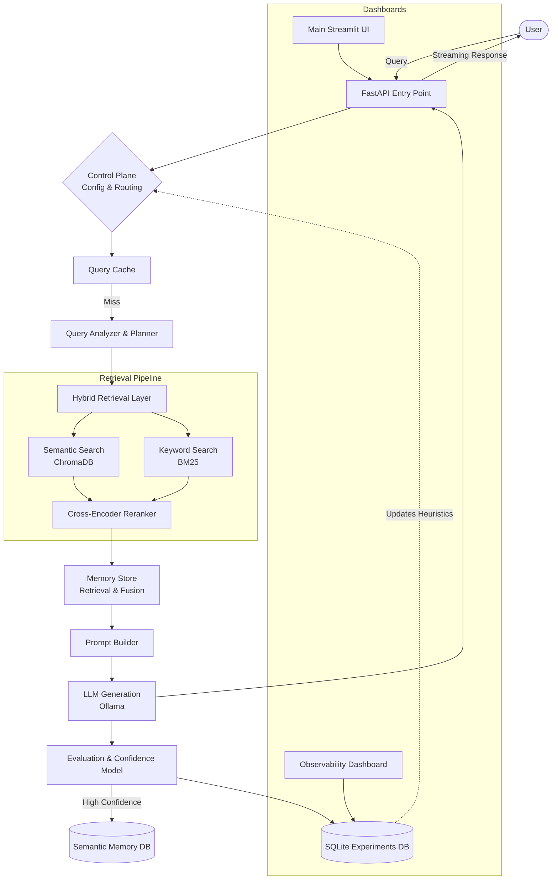

<div align="center">
  <h1>🧠 Self-Optimizing RAG</h1>
  <p><i>An advanced Retrieval-Augmented Generation system that learns, adapts, and optimizes itself based on interaction history and evaluation feedback.</i></p>

  [](https://www.python.org/downloads/)
  [](https://fastapi.tiangolo.com/)
  [](https://www.trychroma.com/)
  [](https://streamlit.io/)
</div>

---

## 🚀 Overview

The **Self-Optimizing RAG** application is a modular framework built for retrieving and intelligently reasoning over data. Unlike static RAG pipelines, this system dynamically adjusts its parameters—such as retrieval chunk size, model selection, and top-k documents—based on past performance, confidence scores, and offline evaluation metrics.

## ✨ Key Features

- 🔄 **Self-Optimizing Engine**: Continuously learns from evaluation results (cosine similarity, answer relevance, faithfulness) to reroute queries to optimal configurations.
- 🧠 **Semantic Memory Store**: High-confidence interactions are saved into a persistent ChromaDB memory module, radically cutting down hallucination and response time for similar future queries.
- 🔀 **Hybrid Retrieval & Reranking**: Combines semantic vector search with exact keyword matching (BM25) and scores the combined context using a Cross-Encoder for maximum accuracy.
- 🧮 **Multi-Hop Query Planning**: Dynamically decomposes complex questions into smaller, independent sub-queries using lightweight LLM analysis.
- 📊 **Observability & Analytics**: Features a built-in Streamlit dashboard tracking system performance, experiment outcomes, and API latencies.

## 🏗️ System Architecture



## 🛠️ Technology Stack

- **Backend Framework:** FastAPI
- **Vector Database:** ChromaDB
- **Keyword Search:** BM25 (`rank_bm25`)
- **Reranking:** Cross-Encoder (`ms-marco-MiniLM-L-6-v2`)
- **Embeddings:** `sentence-transformers` (`all-MiniLM-L6-v2`)
- **LLM Provider:** Local Ollama Endpoint
- **Experiment Tracking:** SQLite
- **UI & Dashboard:** Streamlit

## 💻 Getting Started

### Prerequisites
- Python 3.9+
- [Ollama](https://ollama.com/) installed and running locally with your preferred models (e.g., `llama3`).

### Installation

1. **Clone the repository:**
   ```bash
   git clone https://github.com/niladriroy0/Self-Optimizing-RAG.git
   cd Self-Optimizing-RAG
   ```

2. **Install dependencies:**
   ```bash
   pip install -r requirements.txt
   ```

3. **Ingest Documents:**
   Place your raw `.txt` files in the `data/` directory, then run the ingestion script to populate ChromaDB.
   ```bash
   python scripts/ingest_documents.py
   ```

### Running the Services

The application requires multiple components to be running concurrently.

1. **Start the FastAPI Backend:**
   ```bash
   python -m uvicorn app.main:app --reload
   ```

2. **Launch the User Interface:**
   ```bash
   streamlit run ui/streamlit_app.py
   ```

3. **Launch the Observability Dashboard:**
   ```bash
   streamlit run dashboard/app.py
   ```

## 📂 Codebase Structure

If you'd like an in-depth dive into the directories and files, check out our comprehensive internal documentation:

- 📖 [`CODEBASE_OVERVIEW.md`](./CODEBASE_OVERVIEW.md) - Detailed breakdown of every file, its functions, and purpose.
- 🏛️ [`SYSTEM_ARCHITECTURE.md`](./SYSTEM_ARCHITECTURE.md) - High-level system design, data flow, and deployment mapping.
- 🎓 [`INTERVIEW_GUIDE.md`](./interview_guide.md) - Comprehensive guide on how to pitch and explain this project in interviews.

## 🚀 Roadmap
- **Asynchronous Architecture:** Transition offline evaluation and BM25 index rebuilding to message brokers (e.g., Celery/RabbitMQ).
- **Semantic Query Caching:** Upgrade exact-match caching to vector-similarity to bypass generation bounds for equivalent user intents.
- **Durable Control Plane:** Move dynamic routing state into Redis/SQLite.
- **Agentic Fallbacks:** Offload query string parsing and memory pruning onto localized small-language models (SLMs).

---
<div align="center">
  <i>Built with ❤️ for intelligent data retrieval.</i>
</div>
